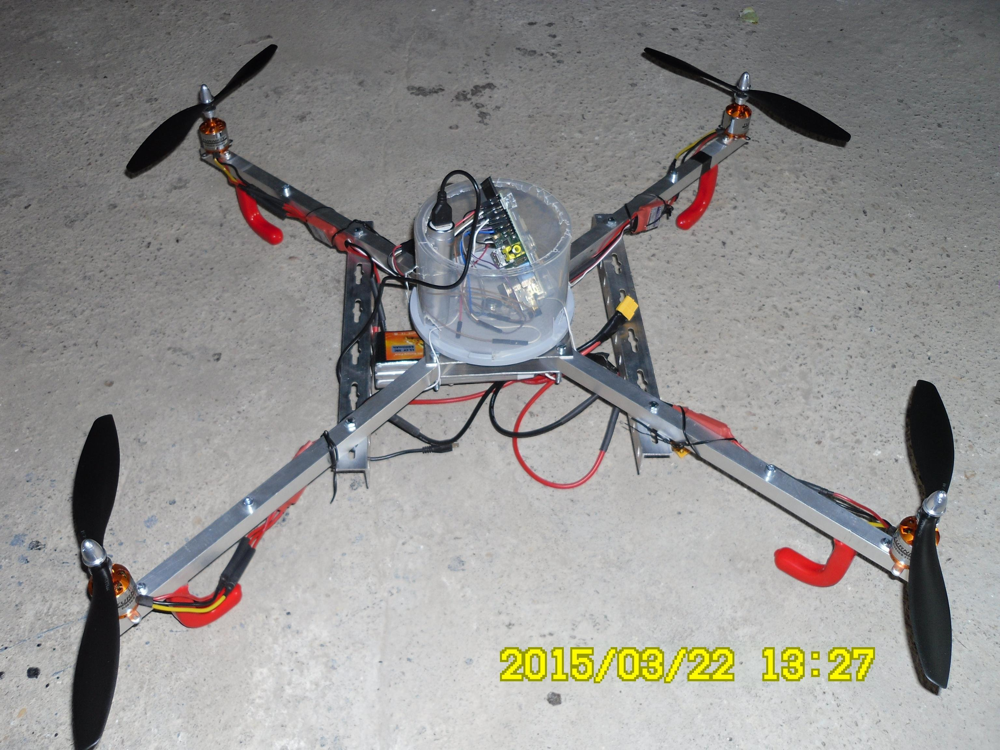

About
=======

Quadcopter Remote Control by RaspberryPi

An application to control remotely a Quadcopter throught a Raspberry Pi. The goal is to be able to command and view what is in front of the quadcopter with a camera.
This feature is allready working using a python Webserver and streaming video from Raspberry Camera, through mjpg-streamer.
You can play also without camera support from command line python script.

Examples
========

Requirements
=============

RPIO Library
https://pypi.python.org/pypi/RPIO

sudo apt-get install python-setuptools
$ sudo easy_install -U RPIO

For Webserver
===============
sudo apt-get install libjs-jquery

For Video Streaming
===================
apt-get install libjpeg62-dev

apt-get install cmake

git clone https://github.com/jacksonliam/mjpg-streamer.git

MPU6050 sensor 
===============

apt-get install python-smbus
apt-get install i2c-tools

/etc/modules
i2c-bcm2708
i2c-dev

/etc/modprobe.d/raspi-blacklist.conf
#blacklist spi-bcm2708
#blacklist i2c-bcm2708

i2cdetect -y 1
#see address 0x68

